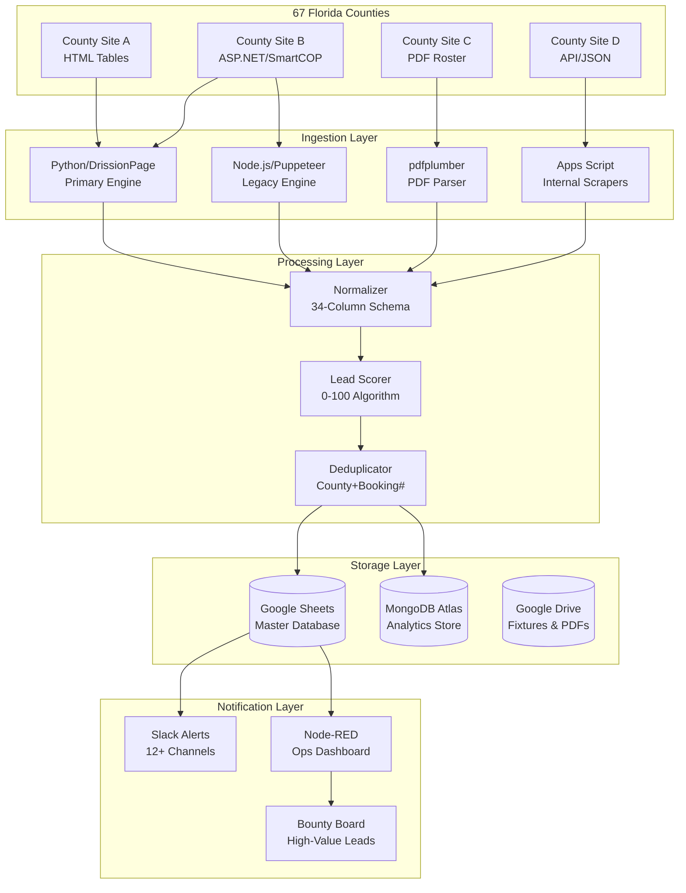

# 🏗️ ARCHITECTURE.md — System Design & Data Flow

> **Pattern: Scrape → Normalize → Score → Write → Notify**

---

## System Overview

The SWFL Arrest Scrapers system is a **multi-county, dual-stack data ingestion pipeline** that converts raw arrest records from Florida county jail rosters into scored, normalized leads stored in Google Sheets and MongoDB Atlas.



---

## Dual-Stack Engine

We maintain two scraping engines for historical and practical reasons:

### Python / DrissionPage (Primary — `counties/*/solver.py`)
| Attribute | Detail |
|---|---|
| **Use Case** | All new counties, Cloudflare-protected sites, complex JS applications |
| **Anti-Detection** | Built-in stealth — mimics real Chrome, bypasses most bot detection |
| **Browser** | Chromium (headless or headful) |
| **Strengths** | Cloudflare bypass, session management, cookie handling |
| **Weaknesses** | Higher memory usage (~300MB per instance), slower startup |
| **Counties** | Charlotte, Hendry, Hillsborough, Manatee, Orange, Palm Beach, Sarasota, Osceola, Pinellas, Polk, Seminole |

### Node.js / Puppeteer (Legacy — `counties/*/solver.js`)
| Attribute | Detail |
|---|---|
| **Use Case** | Simple sites, SmartCOP variants, sites without heavy anti-bot |
| **Anti-Detection** | `puppeteer-extra-plugin-stealth` |
| **Browser** | Chromium via Puppeteer |
| **Strengths** | Faster startup, lower memory, mature ecosystem |
| **Weaknesses** | Less effective against modern anti-bot |
| **Counties** | DeSoto, Collier (via GAS) |

### When to Use Which
```
Is the site protected by Cloudflare/Turnstile?
  → YES → Python/DrissionPage
  → NO  → Is it a SmartCOP system?
            → YES → Clone the DeSoto Node.js pattern
            → NO  → Is it a simple HTML table?
                      → YES → Python/Requests+BS4 (fastest)
                      → NO  → Python/DrissionPage (safest default)
```

---

## Repository Layout

```
swfl-arrest-scrapers/
├── counties/                    # 🏛️ One folder per county (67 total)
│   ├── _template/               #    Scaffold for new counties
│   │   ├── solver.py            #    Solver template
│   │   ├── runner.py            #    Universal pipeline runner
│   │   ├── README.md            #    County README template
│   │   └── quirks.md            #    County-specific notes template
│   ├── charlotte/               #    Charlotte County (Revize CMS)
│   │   ├── solver.py            #    DrissionPage scraper
│   │   ├── runner.py            #    Pipeline: scrape → score → sheets
│   │   └── fixtures/            #    Saved HTML for testing
│   ├── collier/                 #    Collier County (Node.js)
│   │   └── solver.js            #    Puppeteer scraper
│   ├── desoto/                  #    DeSoto County (Node.js)
│   │   ├── solver.js            #    Full scraper
│   │   └── solver_incremental.js #   Incremental scraper
│   ├── hendry/                  #    Hendry (Playwright + API interception)
│   ├── hillsborough/            #    Hillsborough (login required)
│   ├── lee/                     #    Lee (GAS internal trigger)
│   ├── manatee/                 #    Manatee (Revize CMS)
│   ├── orange/                  #    Orange County
│   ├── osceola/                 #    Osceola County
│   ├── palm_beach/              #    Palm Beach County
│   ├── pinellas/                #    Pinellas County
│   ├── polk/                    #    Polk County
│   ├── sarasota/                #    Sarasota (date-iteration)
│   └── seminole/                #    Seminole County
│
├── core/                        # 🧰 Shared Python modules
│   ├── browser.py               #    DrissionPage factory
│   ├── stealth.py               #    Anti-bot evasion utilities
│   ├── normalizer.py            #    Field alias mapping + value cleanup
│   ├── schema.py                #    39-column schema validation
│   ├── dedup.py                 #    Booking_Number + County dedup
│   ├── retry.py                 #    Exponential backoff decorator
│   ├── config_loader.py         #    4-level config merge
│   ├── logging_config.py        #    Structured JSON-lines logging
│   ├── exceptions.py            #    Custom exception hierarchy
│   └── writers/                 #    Output destinations
│       ├── sheets_writer.py     #    Google Sheets (insert at row 2)
│       ├── json_writer.py       #    Local JSON backup
│       └── slack_notifier.py    #    Slack webhook alerts
│
├── config/                      # ⚙️ Configuration
│   ├── global.yaml              #    System-wide defaults
│   ├── schema.json              #    39-column canonical schema
│   ├── field_aliases.json       #    Raw field → schema mappings
│   └── counties/                #    Per-county YAML configs
│       ├── _defaults.yaml       #    Shared county defaults
│       ├── charlotte.yaml       #    Charlotte-specific config
│       └── ...                  #    (14 county configs)
│
├── scripts/                     # 🚀 CLI entry points
│   ├── run_county.py            #    Run a single county scraper
│   ├── run_all.py               #    Run all enabled scrapers
│   └── cleanup_old_dirs.sh      #    One-shot cleanup script
│
├── .agent/                      # 🤖 AI agent instructions
│   ├── IDENTITY.md              #    Agent role & personality
│   ├── RULES.md                 #    Do's and don'ts
│   ├── ADDING_A_COUNTY.md       #    Step-by-step new county guide
│   ├── DEBUGGING_SCRAPERS.md    #    Troubleshooting playbook
│   └── ...                      #    (12 instruction files)
│
├── docs/                        # 📚 Human documentation
│   ├── ARCHITECTURE.md          #    System design & data flow
│   ├── DEPLOYMENT.md            #    Deployment guide
│   ├── SCHEMA.md                #    39-column schema reference
│   └── ...                      #    (see docs/README.md)
│
├── python_scrapers/             # 📦 Legacy (models + scoring only)
│   ├── models/arrest_record.py  #    ArrestRecord dataclass
│   └── scoring/lead_scorer.py   #    LeadScorer class
│
├── .github/workflows/           # 🔄 CI/CD (GitHub Actions)
│
├── docker-compose.yml           # 🐳 Docker orchestration
├── Dockerfile                   # 🐳 Container definition
├── pyproject.toml               # 📦 Python dependencies
├── package.json                 # 📦 Node.js dependencies
└── .env.example                 # 🔐 Environment template
```

---

## Data Flow Pipeline

### Phase 1: Ingestion
```
County Website → Scraper (DrissionPage/Puppeteer) → Raw JSON Records
```
- Scraper navigates to county jail roster
- Bypasses anti-bot measures (Cloudflare, disclaimers, CAPTCHAs)
- Extracts all available fields from each booking entry
- Returns array of raw JSON objects

### Phase 2: Normalization
```
Raw JSON → normalize34() → Unified ArrestRecord Objects
```
- Maps county-specific field names to the 34-column universal schema
- Standardizes date formats (→ `MM/DD/YYYY`), name formats (→ `Last, First Middle`)
- Parses compound fields (multiple charges → pipe-separated list)
- Preserves any extra fields beyond the 34-column baseline

### Phase 3: Scoring
```
ArrestRecord → LeadScorer.score() → Scored Record (0-100)
```
- Evaluates bond amount, charge severity, custody status, data completeness
- Assigns `Lead_Score` (0–100) and `Lead_Status` (Hot/Warm/Cold/Disqualified)
- See `SCHEMA.md` for the full scoring rubric

### Phase 4: Storage
```
Scored Record → SheetsWriter.upsert() → Google Sheets (Master DB)
              → MongoWriter.upsert() → MongoDB Atlas
```
- Deduplicates using `County` + `Booking_Number` composite key
- Inserts new records, updates changed records, skips duplicates
- Mirrors qualified leads (`Score ≥ 70`) to `Qualified_Arrests` tab
- Logs every operation to `Ingestion_Log` tab

### Phase 5: Notification
```
New Records → Slack Webhook → #new-arrests-{county}
Hot Leads → Slack Webhook → #leads (with @channel)
Failures → Slack Webhook → #scraper-alerts
```

---

## Interface Contracts

### Google Sheets API
| Operation | Method | Endpoint |
|---|---|---|
| Read rows | `spreadsheets.values.get` | `sheets/v4` |
| Append rows | `spreadsheets.values.append` | `sheets/v4` |
| Update rows | `spreadsheets.values.update` | `sheets/v4` |
| Batch update | `spreadsheets.values.batchUpdate` | `sheets/v4` |

**Auth:** Service Account (`GOOGLE_SA_KEY_JSON`)
**Sheet ID:** Stored in `GOOGLE_SHEETS_ID` env var

### Slack Webhooks
| Channel | Purpose | Trigger |
|---|---|---|
| `#new-arrests-{county}` | Per-county arrest alerts | Every successful scrape with new records |
| `#leads` | Hot lead alerts | `Lead_Score ≥ 70` |
| `#scraper-alerts` | Error notifications | Any error or anomaly |
| `#drive` | Run summaries | Successful run completion |

### MongoDB Atlas (via Cloud Functions Proxy)
| Operation | Method | Collection |
|---|---|---|
| Upsert record | POST | `arrests` |
| Query by county | GET | `arrests` |
| Aggregate stats | POST | `arrests` |

### GAS Bridge (Node-RED → GAS)
| Action | Method | Purpose |
|---|---|---|
| `fetchLatestArrests` | POST | Pull latest arrests for dashboard |
| `scoreAndSyncQualifiedRows` | POST | Re-score and sync qualified leads |
| `health` | GET | Endpoint health check |

---

## Concurrency Model

### GitHub Actions
- **Staggered cron schedules** prevent concurrent overload
- Each county workflow runs independently
- Typical schedule: every 20 minutes (high-priority) to every 2 hours (low-priority)

### Docker (Local/Production)
- **Sequential execution** within each container
- `docker-compose.yml` defines separate services for Python and Node.js stacks
- Volume mounts for credentials and fixtures

### Error Isolation
```
County A fails → County A logs error, alerts Slack
                → Counties B, C, D continue unaffected
                → No shared state, no shared browser instances
```

---

## Master Data Sources

| Source | URL | Purpose |
|---|---|---|
| Master Google Sheet | `121z5R6Hpqur54GNPC8L26ccfDPLHTJc3_LU6G7IV_0E` | Primary arrest database |
| Arrest Scraper Sheet | `10mphJQkWlDoscDoY8CGFPt96yzoB7rAbDTRrR02orUY` | Secondary/staging |
| MongoDB Atlas | Via Cloud Functions proxy | Analytics and dedup |
| County Strategy CSV | `florida-counties-scraping-strategy.csv` | 67-county expansion plan |

---
*Maintained by: Shamrock Engineering Team & AI Agents*
*Last Updated: March 2026*
