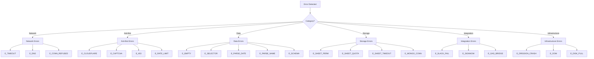

# 🚨 ERROR_CATALOG.md — Comprehensive Error Reference

> **Every error has a code, a cause, and a path to recovery.**

---

## Error Taxonomy



---

## Full Error Reference

### 🌐 Network Errors

| Code | Description | Severity | Auto-Recovery | Manual Resolution |
|---|---|---|---|---|
| `E_TIMEOUT` | Page load exceeded 30s timeout | 🟡 WARN | Retry with 1.5x timeout | Check if site is under load |
| `E_DNS` | DNS resolution failed | 🔴 ERROR | Retry after 60s | Verify URL in county config |
| `E_CONN_REFUSED` | Connection refused by server | 🔴 ERROR | Retry after 120s | Site may be down; check manually |
| `E_SSL` | SSL/TLS handshake failed | 🔴 ERROR | None | Update ca-certificates or check site cert |
| `E_NETWORK` | Generic network error | 🟡 WARN | Retry with backoff | Check runner internet connectivity |

### 🛡️ Anti-Bot Errors

| Code | Description | Severity | Auto-Recovery | Manual Resolution |
|---|---|---|---|---|
| `E_CLOUDFLARE` | Blocked by Cloudflare challenge | 🔴 ERROR | Switch to headful mode | Consult STEALTH_PLAYBOOK.md |
| `E_CAPTCHA` | CAPTCHA challenge presented | 🔴 ERROR | None (requires solver) | Evaluate captcha solver integration |
| `E_403` | HTTP 403 Forbidden | 🔴 ERROR | Rotate user-agent, add delay | IP may be blocked; reduce frequency |
| `E_429` | Rate limited (Too Many Requests) | 🟡 WARN | Exponential backoff (30s, 60s, 120s) | Reduce scrape frequency |
| `E_RATE_LIMIT` | Custom rate limit detection | 🟡 WARN | Increase delays between requests | Adjust per-county schedule |
| `E_TURNSTILE` | Cloudflare Turnstile challenge | 🔴 ERROR | None | Use DrissionPage headful mode |
| `E_BOT_DETECT` | Generic bot detection trigger | 🔴 ERROR | Switch browser profile | Review fingerprint hygiene |

### 📊 Data Errors

| Code | Description | Severity | Auto-Recovery | Manual Resolution |
|---|---|---|---|---|
| `E_EMPTY` | Scraper returned 0 rows | 🟡 WARN | Retry once | If persistent, selectors have changed |
| `E_SELECTOR` | Expected CSS selector not found | 🔴 ERROR | None | Save HTML fixture, update selectors |
| `E_PARSE_DATE` | Date format mismatch | 🟡 WARN | Try all known date formats | Add new format to parser |
| `E_PARSE_NAME` | Name parsing failed | 🟡 WARN | Store raw Full_Name as-is | Review name format for county |
| `E_PARSE_BOND` | Bond amount parsing failed | 🟡 WARN | Default to `0` | Check for new bond format |
| `E_SCHEMA` | Record violates schema constraints | 🟡 WARN | Skip record, log details | Review data quality for county |
| `E_ENCODING` | Character encoding issue | 🟡 WARN | Try UTF-8, Latin-1 fallback | Identify source encoding |
| `E_DUPLICATE_KEY` | Booking number collision | 🔴 ERROR | Skip (dedup logic) | If unexpected, check key generation |

### 💾 Storage Errors

| Code | Description | Severity | Auto-Recovery | Manual Resolution |
|---|---|---|---|---|
| `E_SHEET_PERM` | Access denied to Google Sheet | 🔴 ERROR | None | Re-share sheet with SA email as Editor |
| `E_SHEET_QUOTA` | Google Sheets API quota exceeded | 🔴 ERROR | Wait 60s, retry | Request quota increase or batch writes |
| `E_SHEET_TIMEOUT` | Sheets write operation timed out | 🟡 WARN | Retry once | Check API status, reduce payload |
| `E_SHEET_ROW_LIMIT` | Sheet approaching 10M cell limit | 🔴 ERROR | None | Archive old data to new sheet |
| `E_MONGO_CONN` | MongoDB connection failed | 🟡 WARN | Retry with backoff | Check Atlas cluster status |
| `E_MONGO_TIMEOUT` | MongoDB operation timed out | 🟡 WARN | Retry once | Check query efficiency |
| `E_MONGO_DUP` | MongoDB duplicate key error | 🟢 INFO | Skip (expected for upserts) | None needed |

### 🔗 Integration Errors

| Code | Description | Severity | Auto-Recovery | Manual Resolution |
|---|---|---|---|---|
| `E_SLACK_FAIL` | Slack webhook delivery failed | 🟡 WARN | Retry once | Verify webhook URL in env |
| `E_SIGNNOW` | SignNow packet generation failed | 🔴 ERROR | None | Check SignNow API logs |
| `E_GAS_BRIDGE` | GAS endpoint returned error | 🟡 WARN | Retry with backoff | Check GAS deployment version |
| `E_GAS_AUTH` | GAS API key rejected | 🔴 ERROR | None | Verify API key in env vars |

### 🖥️ Infrastructure Errors

| Code | Description | Severity | Auto-Recovery | Manual Resolution |
|---|---|---|---|---|
| `E_DRISSION_CRASH` | DrissionPage/Chromium crashed | 🔴 ERROR | Restart browser, retry | Increase memory limits |
| `E_PUPPETEER_CRASH` | Puppeteer/Chromium crashed | 🔴 ERROR | Restart browser, retry | Update Puppeteer version |
| `E_OOM` | Out of memory | 🔴 CRITICAL | Kill process, alert | Increase container memory |
| `E_DISK_FULL` | Disk space exhausted | 🔴 CRITICAL | None | Clean temp files, increase disk |
| `E_DOCKER_FAIL` | Docker container failed to start | 🔴 ERROR | None | Check Docker logs |

---

## Recovery Decision Tree

```
Error Detected
    │
    ├── Is it a network error (E_TIMEOUT, E_DNS, E_CONN_REFUSED)?
    │   └── YES → Retry with exponential backoff (3 attempts max)
    │       └── Still failing? → Alert Slack, skip this run
    │
    ├── Is it an anti-bot error (E_CLOUDFLARE, E_403, E_CAPTCHA)?
    │   └── YES → DO NOT RETRY AGGRESSIVELY
    │       ├── Switch to headful mode
    │       ├── Increase delays
    │       ├── Check STEALTH_PLAYBOOK.md
    │       └── If persistent → Pause county, alert Slack
    │
    ├── Is it a data error (E_EMPTY, E_SELECTOR)?
    │   └── YES → Retry once
    │       └── Still empty? → Save fixture, alert for selector review
    │
    ├── Is it a storage error (E_SHEET_*, E_MONGO_*)?
    │   └── YES → Retry with backoff
    │       └── Still failing? → Check API quotas/permissions
    │
    └── Is it an infrastructure error (E_OOM, E_DRISSION_CRASH)?
        └── YES → Kill and restart
            └── Still failing? → Increase resources, alert Slack
```

---

## Historical Incidents

Document resolved incidents here so future agents can learn from them.

### Incident #1: Sarasota Cloudflare Block (Feb 2026)
- **Error:** `E_CLOUDFLARE` — infinite challenge loop
- **Root Cause:** Sarasota Sheriff upgraded to Cloudflare strict mode
- **Resolution:** Switched from `cloudscraper` to `DrissionPage` headful mode
- **Lesson:** When Cloudflare strict mode is engaged, skip lightweight approaches entirely

### Incident #2: Charlotte Selector Change (Jan 2026)
- **Error:** `E_EMPTY` — 0 records for 3 consecutive runs
- **Root Cause:** CCSO redesigned their arrest database page layout
- **Resolution:** Downloaded new HTML fixture, updated CSS selectors
- **Lesson:** Save fixtures regularly for regression comparison

### Incident #3: Sheets API Quota Spike (Dec 2025)
- **Error:** `E_SHEET_QUOTA` — 429 errors during batch run
- **Root Cause:** 6 county scrapers writing simultaneously
- **Resolution:** Staggered cron schedules with 5-minute offsets
- **Lesson:** Never schedule multiple counties at the exact same cron minute

---
*Maintained by: Shamrock Engineering Team & AI Agents*
*Last Updated: March 2026*
