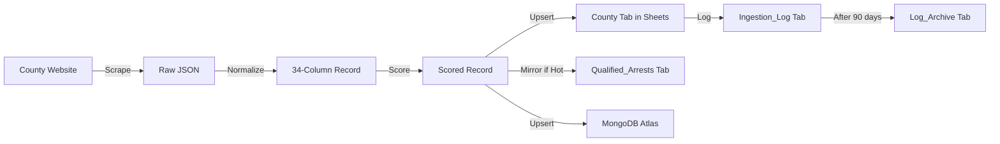

# 📋 SCHEMA.md — Universal Data Model (v3.0)

> **Every record across all 67 counties conforms to this structure.**

---

## The 34-Column Universal Schema

| # | Column | Type | Required | Format / Constraints | Example |
|---|---|---|---|---|---|
| 1 | `Booking_Number` | String | ✅ **PK** | Unique per county. Alphanumeric. | `2026-00142857` |
| 2 | `Full_Name` | String | ✅ | `Last, First Middle` | `SMITH, JOHN MICHAEL` |
| 3 | `First_Name` | String | ✅ | Parsed from Full_Name | `JOHN` |
| 4 | `Last_Name` | String | ✅ | Parsed from Full_Name | `SMITH` |
| 5 | `DOB` | Date | ⚪ | `MM/DD/YYYY` | `05/15/1985` |
| 6 | `Sex` | String | ⚪ | Single char: `M`, `F`, `U` | `M` |
| 7 | `Race` | String | ⚪ | `W`, `B`, `H`, `A`, `I`, `U` | `W` |
| 8 | `Arrest_Date` | String | ⚪ | `MM/DD/YYYY` | `03/10/2026` |
| 9 | `Arrest_Time` | String | ⚪ | `HH:MM` (24hr) | `14:30` |
| 10 | `Booking_Date` | String | ⚪ | `MM/DD/YYYY` | `03/10/2026` |
| 11 | `Booking_Time` | String | ⚪ | `HH:MM` (24hr) | `15:45` |
| 12 | `Agency` | String | ⚪ | Arresting agency name | `Fort Myers PD` |
| 13 | `Address` | String | ⚪ | Street address | `1528 Broadway` |
| 14 | `City` | String | ⚪ | City name | `Fort Myers` |
| 15 | `State` | String | ⚪ | 2-letter code | `FL` |
| 16 | `Zip` | String | ⚪ | 5 or 9 digit | `33901` |
| 17 | `Charges` | String | ✅ | Pipe-separated `\|` list | `DUI\|RECKLESS DRIVING` |
| 18 | `Charge_1_Description` | String | ⚪ | Primary charge text | `DUI - 1ST OFFENSE` |
| 19 | `Charge_1_Statute` | String | ⚪ | Florida statute code | `316.193(1)` |
| 20 | `Charge_1_Level` | String | ⚪ | `F` (Felony), `M` (Misd) | `M` |
| 21 | `Charge_2_Description` | String | ⚪ | Secondary charge text | `RECKLESS DRIVING` |
| 22 | `Charge_2_Statute` | String | ⚪ | Florida statute code | `316.192` |
| 23 | `Charge_2_Level` | String | ⚪ | `F` or `M` | `M` |
| 24 | `Bond_Amount` | Number | ⚪ | Numeric only. No `$`, no commas. | `5000` |
| 25 | `Bond_Type` | String | ⚪ | `Cash`, `Surety`, `ROR`, `No Bond` | `Surety` |
| 26 | `Status` | String | ⚪ | `In Custody`, `Released`, `Bonded Out` | `In Custody` |
| 27 | `Court_Date` | Date | ⚪ | `MM/DD/YYYY` | `04/15/2026` |
| 28 | `Case_Number` | String | ⚪ | Court case ID | `26-CF-001234` |
| 29 | `Mugshot_URL` | URL | ⚪ | Direct link to source image | `https://...jpg` |
| 30 | `County` | String | ✅ **PK** | UPPERCASE county name | `LEE` |
| 31 | `Court_Location` | String | ⚪ | Courthouse name | `Lee County Justice Center` |
| 32 | `Detail_URL` | URL | ⚪ | Link to county detail page | `https://...` |
| 33 | `Lead_Score` | Number | ✅ | 0–100, calculated | `85` |
| 34 | `Lead_Status` | String | ✅ | `Hot`, `Warm`, `Cold`, `Disqualified` | `Hot` |

### Composite Primary Key
```
UNIQUE KEY = County + Booking_Number
```
This key is used for deduplication across all storage systems (Sheets, MongoDB, Slack).

---

## Field Validation Rules

### Required Fields (Must Never Be Empty)
| Field | Fallback if Missing |
|---|---|
| `Booking_Number` | **Skip entire record** — cannot ingest without a key |
| `Full_Name` | **Skip entire record** — cannot identify defendant |
| `County` | Hardcoded by the scraper (never from source data) |
| `Lead_Score` | Default to `0` if scorer fails |
| `Lead_Status` | Default to `Cold` if scorer fails |
| `Charges` | Set to `UNKNOWN` — still ingest the record |

### Standardization Rules
| Field | Rule |
|---|---|
| `Full_Name` | `UPPERCASE`. Format: `LAST, FIRST MIDDLE` |
| `DOB` | Always `MM/DD/YYYY`. Parse from any source format. |
| `Sex` | Normalize: `Male`→`M`, `Female`→`F`, else→`U` |
| `Race` | Normalize: `White`→`W`, `Black`→`B`, `Hispanic`→`H`, `Asian`→`A`, else→`U` |
| `Bond_Amount` | Strip `$`, commas, spaces. Parse to integer. `No Bond`→`0`. |
| `Charges` | Pipe-separate multiple charges: `CHARGE_1\|CHARGE_2\|CHARGE_3` |
| `County` | UPPERCASE, no spaces in code: `LEE`, `PALM_BEACH`, `ST_LUCIE` |
| `Scrape_Timestamp` | ISO 8601: `2026-03-11T14:30:00Z` |

---

## County-Specific Extensions

The 34-column schema is a **floor**, not a ceiling. Counties may provide additional data:

```
Base Columns (1-34):  Universal across all counties
Extended Columns (35+):  County-specific bonus fields
```

**Examples:**
| County | Extra Columns | Notes |
|---|---|---|
| Hillsborough | `Facility`, `Pod`, `Cell_Number` | Housing details |
| Orange | `Warrant_Number`, `ICE_Hold` | Immigration hold flag |
| Palm Beach | `Attorney_Name`, `Probation_Status` | Legal context |

**Rule:** If a county provides it, we capture it. Append new columns to the right of the sheet. Never discard data.

---

## Lead Scoring Algorithm (v2.1)

### Scoring Rubric (Max 100)

#### Positive Modifiers
| Factor | Points | Condition |
|---|---|---|
| **Bond Sweet Spot** | +30 | `$500 ≤ Bond_Amount ≤ $50,000` |
| **High Bond** | +20 | `$50,001 ≤ Bond_Amount ≤ $100,000` |
| **Premium Bond** | +10 | `Bond_Amount > $100,000` |
| **In Custody** | +20 | `Status = "In Custody"` |
| **Bondable Charge** | +20 | Keywords: Battery, DUI, Theft, Drug Possession, Burglary |
| **Cash/Surety Bond** | +25 | `Bond_Type IN ("Cash", "Surety")` |
| **Data Complete** | +15 | All required fields present + DOB + charges |
| **Recent Booking** | +10 | Booked within last 24 hours |

#### Negative Modifiers
| Factor | Points | Condition |
|---|---|---|
| **Released** | -30 | `Status = "Released"` or `"Bonded Out"` |
| **No Bond** | -50 | `Bond_Amount = 0` or `Bond_Type = "No Bond"` |
| **Capital Charge** | -100 | Murder, Capital Sexual Battery, Federal charges |
| **Hold/Detainer** | -30 | ICE hold, out-of-county warrant |
| **Minor Offense** | -10 | Trespassing, loitering, open container |

#### Classification Thresholds
| Score Range | Status | Slack Alert | Action |
|---|---|---|---|
| **≥ 70** | 🔴 `Hot` | `@channel` in `#leads` | Immediate outreach |
| **40–69** | 🟡 `Warm` | Summary only | Priority follow-up |
| **1–39** | 🔵 `Cold` | None | Archive for analytics |
| **≤ 0** | ⚫ `Disqualified` | None | Capital/federal flag |

---

## Data Lifecycle



### Retention Policy
| Data | Location | Retention | Deletion Policy |
|---|---|---|---|
| Arrest records | County sheet tabs | **Indefinite** | Never delete |
| Qualified leads | `Qualified_Arrests` tab | **Indefinite** | Never delete |
| Ingestion logs | `Ingestion_Log` tab | 90 days | Archive to `Log_Archive` |
| HTML fixtures | `fixtures/` directory | 30 days | CI maintenance prunes |
| MongoDB records | Atlas cluster | **Indefinite** | Atlas retention policy |

---

## Ingestion Log Schema

Every scraper run appends a row to `Ingestion_Log`:

| Column | Type | Example |
|---|---|---|
| `Timestamp` | ISO 8601 | `2026-03-11T14:30:00Z` |
| `County` | String | `CHARLOTTE` |
| `Records_Found` | Number | `47` |
| `Records_Inserted` | Number | `3` |
| `Records_Updated` | Number | `1` |
| `Records_Skipped` | Number | `43` |
| `Errors` | Number | `0` |
| `Duration_Seconds` | Number | `28` |
| `Engine` | String | `python/drissionpage` |
| `Status` | String | `SUCCESS` or error code |

---
*Maintained by: Shamrock Engineering Team & AI Agents*
*Last Updated: March 2026*
