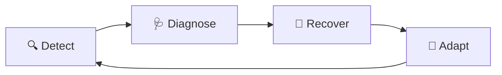

# 🧬 SELF_HEALING.md — The Immune System

> **A scraper that breaks is expected. A scraper that stays broken is unacceptable.**

This document defines how the system detects, diagnoses, recovers from, and adapts to failures — automatically where possible, with human escalation only as a last resort.

---

## Philosophy

The SWFL Arrest Scrapers will run continuously across 67 counties for **years**. County websites will change. Anti-bot systems will evolve. APIs will break. New CAPTCHAs will appear.

**Self-healing is not optional — it is the architecture.**



---

## 1. Detection — How We Spot Problems

### Automated Detection Signals

| Signal | Condition | Severity | Source |
|---|---|---|---|
| **Zero Records** | `Records_Found = 0` for a county that normally returns data | 🟡 WARN | `Ingestion_Log` |
| **Consecutive Failures** | 3+ runs with 0 records or error status | 🔴 ERROR | Counter in scraper |
| **Error Code Spike** | Same `E_*` code appearing 3+ times in 1 hour | 🔴 ERROR | `Ingestion_Log` |
| **Duration Spike** | Run takes >3x the county's average duration | 🟡 WARN | `Duration_Seconds` |
| **Record Count Anomaly** | Records found deviates >50% from rolling average | 🟡 WARN | Statistical comparison |
| **Stale Data** | No new `Ingestion_Log` entry for a county in >4 hours | 🔴 ERROR | Timestamp check |
| **Slack Delivery Failure** | Webhook returns non-200 | 🟡 WARN | `slack/notify.js` |

### Detection Infrastructure
- **Primary:** `Ingestion_Log` tab in Google Sheets (every run appends a row)
- **Secondary:** Slack `#scraper-alerts` channel (real-time error alerts)
- **Tertiary:** GitHub Actions run history (per-workflow success/failure)
- **Future:** Node-RED health dashboard with county-level gauges

---

## 2. Diagnosis — What Went Wrong

### Automated Triage Logic

When a failure is detected, the system should classify it:

```
Failure Detected
    │
    ├── HTTP Status Code?
    │   ├── 403 → DIAGNOSIS: IP blocked or anti-bot
    │   ├── 429 → DIAGNOSIS: Rate limited  
    │   ├── 500 → DIAGNOSIS: Server error (their problem)
    │   ├── 503 → DIAGNOSIS: Site maintenance
    │   └── None → DIAGNOSIS: Network/DNS failure
    │
    ├── Page loaded but 0 records?
    │   ├── Page has CAPTCHA/challenge → DIAGNOSIS: Anti-bot escalation
    │   ├── Page has data but selectors miss → DIAGNOSIS: Selector drift
    │   └── Page genuinely has 0 inmates → DIAGNOSIS: Normal (low-volume county)
    │
    ├── Browser crashed?
    │   ├── OOM kill → DIAGNOSIS: Memory pressure
    │   ├── Timeout → DIAGNOSIS: Page too complex or slow
    │   └── Segfault → DIAGNOSIS: Chromium bug
    │
    └── Write failed?
        ├── 401/403 → DIAGNOSIS: Credential expired
        ├── 429 → DIAGNOSIS: API quota
        └── Timeout → DIAGNOSIS: API overload
```

### Diagnostic Tools
| Tool | Purpose | Command |
|---|---|---|
| Save HTML fixture | Capture page state for offline debugging | Automated in solver on failure |
| Check site manually | Verify site is accessible in normal browser | Visit URL in Chrome |
| Review `Ingestion_Log` | Find error patterns over time | Check Sheets `Ingestion_Log` tab |
| GitHub Actions logs | Full execution trail for each run | GitHub → Actions → Workflow run |
| Docker logs | Container-level output | `docker-compose logs python-scrapers` |

---

## 3. Recovery — How We Fix It

### Recovery Chains (Ordered by Aggression)

#### For Anti-Bot Blocks
```
Level 1: Add 5-second delay between requests
    ↓ Still blocked?
Level 2: Switch from headless to headful mode
    ↓ Still blocked?
Level 3: Rotate user-agent string
    ↓ Still blocked?
Level 4: Switch to a different browser profile
    ↓ Still blocked?
Level 5: Reduce frequency (e.g., every 2h instead of 30m)
    ↓ Still blocked?
Level 6: PAUSE county, alert human via Slack
```

#### For Selector Drift
```
Level 1: Retry once (may be transient page load issue)
    ↓ Still failing?
Level 2: Save fixture, attempt CSS selector auto-detection
    ↓ Can't auto-detect?
Level 3: Alert developer agent to update selectors
    ↓ New selectors found?
Level 4: Test locally, deploy, monitor 3 runs
```

#### For Infrastructure Failures
```
Level 1: Automatic retry with exponential backoff (30s, 60s, 120s)
    ↓ Still failing?
Level 2: Kill and restart the browser/container
    ↓ Still failing?
Level 3: Increase resource allocation (memory, timeout)
    ↓ Still failing?
Level 4: Alert human, provide full diagnostic context
```

#### For Storage Failures
```
Level 1: Retry write operation once
    ↓ Still failing?
Level 2: Queue records in memory, retry batch after 60s
    ↓ Still failing?
Level 3: Write records to local JSON file as backup
    ↓ Still failing?
Level 4: Alert Slack with backed-up record count
```

### Circuit Breaker Pattern
For each county, maintain a failure counter:
```python
consecutive_failures = 0
MAX_FAILURES = 3

if scrape_failed:
    consecutive_failures += 1
    if consecutive_failures >= MAX_FAILURES:
        PAUSE county
        alert_slack(f"⚠️ {county} paused after {MAX_FAILURES} consecutive failures")
else:
    consecutive_failures = 0  # Reset on success
```

---

## 4. Adaptation — How We Evolve

### After Every Incident
1. **Document** the incident in `MEMORY.md` with root cause and resolution
2. **Update** `ERROR_CATALOG.md` if a new error code was encountered
3. **Add** a regression test fixture if selector drift was the cause
4. **Adjust** the scrape frequency if rate limiting was the cause
5. **Update** `COUNTY_REGISTRY.md` with any new known quirks

### Proactive Adaptation
| Activity | Frequency | Purpose |
|---|---|---|
| Update DrissionPage | Monthly | Stay ahead of anti-bot evolution |
| Refresh user-agent pool | Monthly | Avoid stale fingerprints |
| Audit HTML fixtures | Quarterly | Detect slow selector drift |
| Review scrape frequencies | Quarterly | Optimize based on data patterns |
| Test backup recovery | Quarterly | Verify recovery chains work |

### Evolution Patterns
When a county site undergoes a major redesign:
```
1. Mark county as PAUSED in COUNTY_REGISTRY.md
2. Download fresh HTML fixture of new layout
3. Analyze new page structure (tables, APIs, JS rendering)
4. Rewrite solver if necessary (keep old solver as .bak for reference)
5. Test with 5 consecutive runs (verify idempotency)
6. Promote back to STABLE
7. Update MEMORY.md with redesign details
```

---

## Post-Mortem Template

When a significant incident occurs, document it using this format:

```markdown
## Incident: [County] — [Brief Description]
**Date:** YYYY-MM-DD
**Duration:** X hours (from detection to resolution)
**Severity:** WARN / ERROR / CRITICAL
**Error Code:** E_*

### Timeline
- HH:MM — First failure detected
- HH:MM — Diagnosis identified
- HH:MM — Recovery action taken
- HH:MM — Service restored

### Root Cause
[What actually broke and why]

### Resolution
[What was done to fix it]

### Lessons Learned
[What we'll do differently next time]

### Action Items
- [ ] Update MEMORY.md
- [ ] Update selectors / config
- [ ] Add regression fixture
- [ ] Adjust monitoring thresholds
```

---
*Maintained by: Shamrock Engineering Team & AI Agents*
*Last Updated: March 2026*
